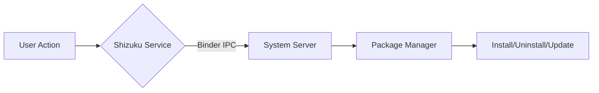

# Shizu CoreFetch

 

 <strong>An advanced, Shizuku-powered application hub for Android.</strong> 
 Fetch, manage, and silently update your apps with system-level privileges — entirely open source.

 
 
 
 

---

## 📖 Overview

**Shizu CoreFetch** is a next‑generation application manager for Android that leverages the **Shizuku** API to perform silent installs, uninstalls, and background updates without requiring root access. It comes bundled with a local **APK wallet**, a centralized repository browser, GitHub authentication, and real‑time notifications — all wrapped in a clean, modern interface that supports light/dark themes and 9 languages.

> ⚡ Perfect for power users, developers, and anyone tired of manual package management.

---

> ⚠️ **Notice for Developers:** The source code currently available in this repository reflects stable version **1.0.0**. The latest ecosystem features of version **1.2.0** (such as Zero-Quota Architecture, the Comment System, App Ratings, and Whitelisted Banner Ads) are currently available exclusively in the compiled APK on the [Releases](https://github.com/elhizazi1/ShizuCoreFetch/releases) page. The repository source code will be fully synced soon.

---

## ✨ Key Features

- **Silent Operations with Shizuku:** Install, uninstall, and update apps directly at system level — fully supports both **Root** and Wireless Debugging (**ADB**).
- **Zero-Quota Architecture:** Browse and download seamlessly without hitting GitHub API rate limits. The store handles high traffic effortlessly.
- **Centralized Repository:** Browse and fetch applications from a curated repository. Each app includes screenshots, description, developer info, and version history.
- **Local Storage Wallet:** Store downloaded APKs locally, share them via any app, or open them with external file viewers. Delete packages with a single tap to free up space.
- **Update Notifications:** Receive alerts when new versions of your installed apps become available. Background checks ensure you never miss an update.
- **GitHub Integration:** Sign in with your GitHub account or continue as a guest. Your installed apps and update status are tied to your profile (optional).
- **Multi‑Language:** Available in 11 languages: العربية, English, Français, Español, Português, Русский, हिन्दी, 中文, 日本語, Türkçe, Čeština.
- **Dynamic Theming:** Switch between Light, Dark, and System‑follow modes on the fly.
- **Privacy First:** 100% offline‑first architecture. No tracking, no analytics, no data collection. Your apps and data stay on your device.

---

## 📱 Screenshots

 
 

---

## 📦 Requirements

- Android 8.0+ (API 26)
- [Shizuku](https://play.google.com/store/apps/details?id=moe.shizuku.privileged.api) installed and running on your device
- Network permission (for fetching app data from the repository)
- Storage permission (for saving and sharing APK files)

> Root access is **not** required.

---

## 🚀 Installation

1. **Download the latest APK** from the [Releases page](https://github.com/elhizazi1/ShizuCoreFetch/releases/latest).
2. Install the APK on your Android device (you may need to allow “Install from unknown sources”).
3. Open **Shizuku** and start the service.
4. Launch **Shizu CoreFetch** → grant the Shizuku permission when prompted.
5. You’re all set! Browse the repository or use the wallet to manage your packages.

---

## 🧠 How It Works

Shizu CoreFetch uses the Shizuku Binder API to execute privileged commands directly on the Android package manager. This enables:

- **Silent install** (`pm install`)
- **Silent uninstall** (`pm uninstall`)
- **Background updates** without any pop‑ups

The app itself runs without root, making it safe and compliant with modern Android security policies.

---

## 🌍 Localization

All user‑facing strings are translated into the following languages:

| Language | Status |
|---|---|
| العربية (Arabic) | ✅ Complete |
| English (en) | ✅ Complete |
| Français (French) | ✅ Complete |
| Español (Spanish) | ✅ Complete |
| Português (Portuguese) | ✅ Complete |
| Русский (Russian) | ✅ Complete |
| हिन्दी (Hindi) | ✅ Complete |
| 中文 (Chinese) | ✅ Complete |
| 日本語 (Japanese) | ✅ Complete |
| Türkçe (Turkish) | ✅ Complete |
| Čeština (Czech) | ✅ Complete |

---

## 🛠️ Tech Stack

- **Language:** Kotlin
- **UI Architecture:** XML Layouts + ViewBinding + Material Design 3 Components
- **Networking:** Retrofit 2 + OkHttp + Java HttpURLConnection (for direct GitHub REST API operations)
- **Local Caching & Storage:** SharedPreferences Architecture (via custom managers)
- **Concurrency:** Native Kotlin Threads + Android Main Looper Handlers
- **Rich Text Rendering:** Markwon Markdown Library (for Readme displaying)
- **Image Loading:** Coil (with custom rounded corner transformations)
- **Cloud Backend:** Google Apps Script + Google Sheets API (for central catalog and blacklists)
- **Build System:** Gradle

---

## 🤝 Contributing & Acknowledgments

We welcome contributions! If you’d like to improve Shizu CoreFetch, please follow these steps:

1. Fork the repo
2. Create a feature branch (`git checkout -b feature/amazing-feature`)
3. Commit your changes (`git commit -m 'Add amazing feature'`)
4. Push to the branch (`git push origin feature/amazing-feature`)
5. Open a Pull Request

Read the full Contribution Guidelines for details on coding conventions and localization.

### 🌟 Community Shoutout
A massive thank you to our incredible open-source community! Thanks to your dedicated efforts, we have recently expanded our global reach with full native support for new languages. Special thanks to:

* **Turkish (Türkçe):** Translated by [AhmetCanArslan](https://github.com/AhmetCanArslan)
* **Czech (Čeština):** Translated by [Jakub K. (@kouzelnik3)](https://github.com/kouzelnik3)

Your contributions are what make Shizu CoreFetch a truly global and accessible platform for everyone.

---

## Acknowledgments & Design Assets

The user interface of Shizu CoreFetch relies on clean and professional iconography. The icons used throughout the application are sourced from the **[Iconsax](https://github.com/glenthemes/iconsax/tree/gh-pages)** library. To ensure optimal performance, crisp scaling across all screen densities, and memory efficiency on Android, all utilized icons were converted from their original formats into native Android Vector Drawable (XML) formats.

---

## 📜 License

This project is licensed under the GNU General Public License v3.0 – see the [LICENSE](LICENSE) file for details.

---

For complete documentation on every field, locale, and best practice, visit the official Shizu CoreFetch docs here:  
**[https://docshizu.siwane.xyz/](https://docshizu.siwane.xyz/)**

You don't need to send anything or register. Just add a valid `shizu_store.json` file at the root of your repository, and the store will automatically display your app professionally, with localized descriptions and seamless support for your own ads.

---

## 👤 Author & Contact

**Jamal El Hizazi**

- **GitHub:** [@elhizazi1](https://github.com/elhizazi1)
- **Email:** jamal@elhizazi.me
- **Website:** [Siwane.xyz](https://siwane.xyz)

For support or questions, open an issue on the repository or reach out via email.

---

Made with ❤️ for the Android community

