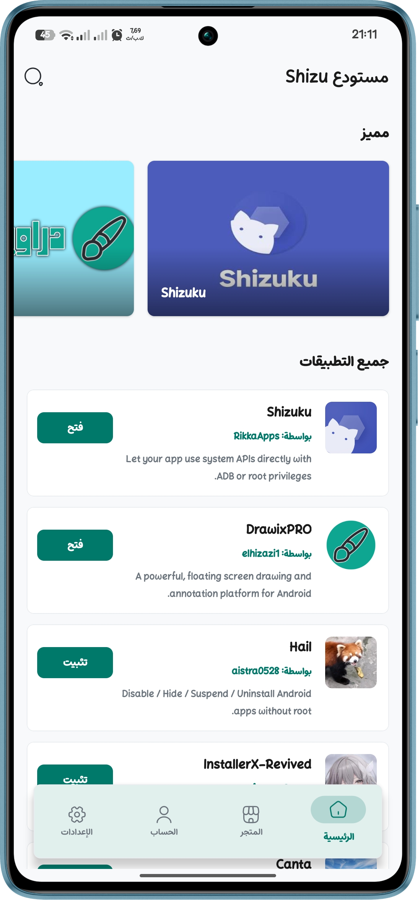
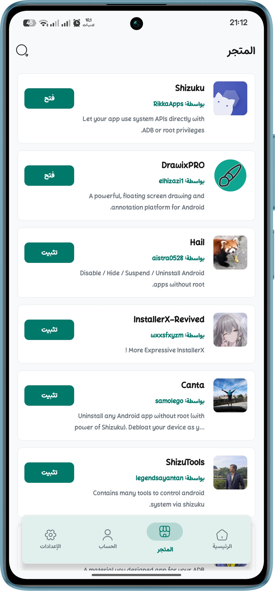
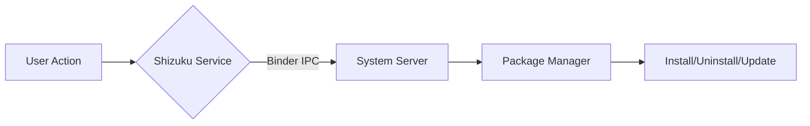

# Shizu CoreFetch

  

  <strong>An advanced, Shizuku-powered application hub for Android.</strong> 
  Fetch, manage, and silently update your apps with system-level privileges — entirely open source.

  
  
  
  

---

## 📖 Overview

**Shizu CoreFetch** is a next‑generation application manager for Android that leverages the **Shizuku** API to perform silent installs, uninstalls, and background updates without requiring root access. It comes bundled with a local **APK wallet**, a centralized repository browser, GitHub authentication, and real‑time notifications — all wrapped in a clean, modern interface that supports light/dark themes and 8 languages.

> ⚡ Perfect for power users, developers, and anyone tired of manual package management.

---

## ✨ Key Features

- **Silent Operations with Shizuku**  
  Install, uninstall, and update apps directly at system level — no user interaction needed once permissions are granted.

- **Centralized Repository**  
  Browse and fetch applications from a curated repository. Each app includes screenshots, description, developer info, and version history.

- **Local Storage Wallet**  
  Store downloaded APKs locally, share them via any app, or open them with external file viewers. Delete packages with a single tap to free up space.

- **Update Notifications**  
  Receive alerts when new versions of your installed apps become available. Background checks ensure you never miss an update.

- **GitHub Integration**  
  Sign in with your GitHub account or continue as a guest. Your installed apps and update status are tied to your profile (optional).

- **Multi‑Language**  
  Available in 8 languages: العربية, English, Français, Español, Português, Русский, हिन्दी, 中文.

- **Dynamic Theming**  
  Switch between Light, Dark, and System‑follow modes on the fly.

- **Privacy First**  
  100% offline‑first architecture. No tracking, no analytics, no data collection. Your apps and data stay on your device.

---

## 📱 Screenshots

  
  
  

---

## 📦 Requirements

- Android 8.0+ (API 26)
- [Shizuku](https://play.google.com/store/apps/details?id=moe.shizuku.privileged.api) installed and running on your device
- Network permission (for fetching app data from the repository)
- Storage permission (for saving and sharing APK files)

> Root access is **not** required.

---

## 🚀 Installation

1. **Download the latest APK** from the [Releases page](https://github.com/elhizazi1/ShizuCoreFetch/releases/latest).
2. Install the APK on your Android device (you may need to allow “Install from unknown sources”).
3. Open **Shizuku** and start the service.
4. Launch **Shizu CoreFetch** → grant the Shizuku permission when prompted.
5. You’re all set! Browse the repository or use the wallet to manage your packages.

---

## 🧠 How It Works

Shizu CoreFetch uses the Shizuku Binder API to execute privileged commands directly on the Android package manager. This enables:

- **Silent install** (`pm install`)
- **Silent uninstall** (`pm uninstall`)
- **Background updates** without any pop‑ups

The app itself runs without root, making it safe and compliant with modern Android security policies.

---

🌍 Localization

All user‑facing strings are translated into the following languages:

Language Status
العربية (Arabic) ✅ Complete
English (en) ✅ Complete
Français (French) ✅ Complete
Español (Spanish) ✅ Complete
Português (Portuguese) ✅ Complete
Русский (Russian) ✅ Complete
हिन्दी (Hindi) ✅ Complete
中文 (Chinese) ✅ Complete
日本語 (Japanese) ✅ Complete

Missing a language? Contributions are welcome! See the Contribution Guide.

---

🛠️ Tech Stack

· Language: Kotlin
· UI: Jetpack Compose
· DI: Hilt
· State Management: ViewModel + StateFlow
· Networking: Retrofit + OkHttp
· Local Storage: Room Database, DataStore
· Shizuku Integration: rikka.shizuku APIs
· Build System: Gradle with Kotlin DSL

---

🤝 Contributing

We welcome contributions! If you’d like to improve Shizu CoreFetch, please follow these steps:

1. Fork the repo
2. Create a feature branch (git checkout -b feature/amazing-feature)
3. Commit your changes (git commit -m 'Add amazing feature')
4. Push to the branch (git push origin feature/amazing-feature)
5. Open a Pull Request

Read the full Contribution Guidelines for details on coding conventions and localization.

---

📜 License

This project is licensed under the MIT License – see the LICENSE file for details.

---

👤 Author & Contact

Jamal El Hizazi

· GitHub: @elhizazi1
· Email: jamal@elhizazi.me
· Website: Siwane.xyz

For support or questions, open an issue on the repository or reach out via email.

---

  Made with ❤️ for the Android community

